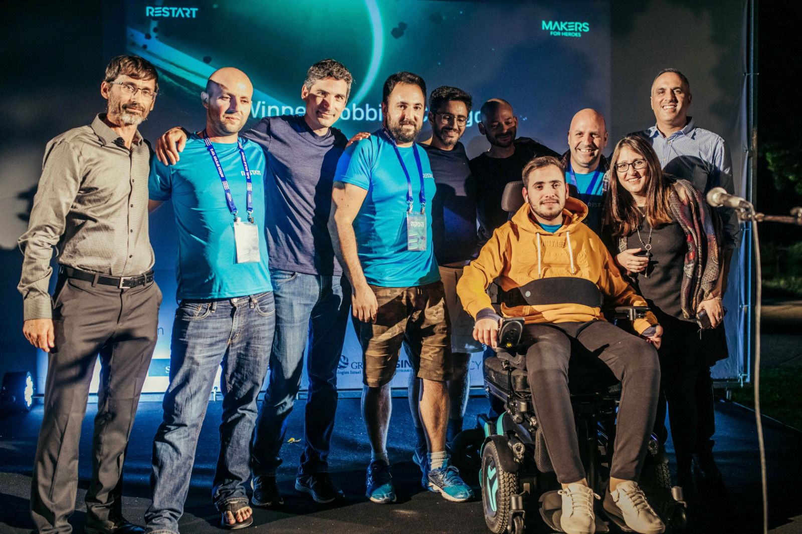

# Makers21

**A multiplayer 3D space game that anyone can play — even with just their head.**

Makers21 was built for a friend who became paralyzed in an accident. He can only move his neck and face. We wanted him to be able to play with his friends — not as a spectator, not with a handicap — but as an equal. So we built a capture-the-flag space game controlled entirely by webcam head tracking, running in the browser with zero installation.

If you can move your head, you can fly a spaceship, shoot enemies, capture flags, and compete in real-time multiplayer. No special hardware. No downloads. Just open a link and play.

---

https://github.com/user-attachments/assets/37d80d71-d99b-4ff7-b6e5-0f469f3b2b4d

[Watch in full quality on YouTube](https://youtu.be/wz4GonJ0T_Y)

---

## Why This Exists

People with quadriplegia, ALS, muscular dystrophy, and other conditions that limit mobility are often excluded from multiplayer gaming — or stuck playing solo-friendly titles while their friends play together. Existing adaptive controllers are expensive and still can't match the speed of standard gamepads.

Makers21 takes a different approach: **the game itself is the adaptive controller.** Head tracking is the native input — not an afterthought or accessibility mode. Every player uses the same controls, so disabled and able-bodied players compete on equal footing.

## Key Highlights

- **Play with your head** — Webcam tracks your face movements to steer, aim, and play. No hands needed.
- **Equal playing field** — Head tracking is the native control for everyone. Disabled and able-bodied players compete with the same skills — no advantage, no handicap.
- **3D multiplayer in the browser** — Real-time team-based capture-the-flag in space. Just share a link.
- **Open source, open for development** — Built to be extended, forked, and improved by the community.

## How It Works

Your webcam feeds into [MediaPipe Face Mesh](https://google.github.io/mediapipe/solutions/face_mesh.html), which tracks 468 facial landmarks in real time. Head tilt and rotation map to ship controls — look left to turn left, look up to climb. The game runs on [Three.js](https://threejs.org/) with a WebRTC-based server (mediasoup SFU) for low-latency multiplayer.

No data leaves your machine — the video stays local, only control signals are sent to the game.

## Rooms & Lobby

Makers21 uses a lobby system where players create and join rooms before a game starts.

**Lobby** — A lightweight landing page (no 3D, no camera) served at the root URL:
- Browse active rooms with player counts and team balance
- Create a room and share the invite link with friends
- Join a room, pick Team Alpha or Team Bravo (up to 6 per team)
- Host starts the game — all players are redirected to the 3D game page

**Invite links** — Click "Copy" to get a shareable link (e.g. `https://your-server.com?room=abc123`). Send it over Discord, WhatsApp, or any IM. Friends click the link and land directly in the room.

**Room lifecycle:**
- Rooms lock when the game starts — no mid-game joining
- The room host can kick players and start/reset the game
- Empty rooms are automatically cleaned up after 5 minutes

## Architecture

```
Browser (lobby)  ──HTTP/WS──>  Server (rooms, signaling, game logic)
Browser (game)   ──WebRTC───>  mediasoup SFU  ──WebRTC──>  other players
```

- **Lobby & signaling** — Express HTTP for room CRUD, WebSocket for real-time lobby events and WebRTC negotiation
- **Game data** — [mediasoup](https://mediasoup.org/) SFU relays position, fire, and game state via WebRTC data channels (UDP-like, unreliable/unordered — no head-of-line blocking)
- **Game logic** — Server-side game engine per room handles flag capture, gate passes, win conditions, and disconnect detection
- **Face tracking** — MediaPipe runs client-side; only control signals leave the browser

## Getting Started

### Prerequisites

- Node.js v20+ (server-v2 requires it for mediasoup)
- npm
- A webcam (or use mouse+keyboard fallback)
- Modern browser with WebGL and WebRTC support

### Install and Run

```bash
git clone https://github.com/orbs-network/makers21.git
cd makers21

# Build the game client
npm install
npm run build

# Start the server (serves both lobby and game)
cd server-v2
npm install
node index.js
```

Open `http://localhost:4000` — you'll land on the lobby. Create a room, pick a team, and start the game.

### Development

```bash
# Terminal 1 — run server-v2
cd server-v2 && node index.js

# Terminal 2 — webpack dev build (watches for changes, outputs to dist/)
npm run build -- --watch --mode development
```

### Production Build

```bash
npm run build
```

Built files go to `dist/`. The server-v2 serves them alongside the lobby.

## Game Controls

| Control | Head Tracking | Keyboard/Mouse |
|---|---|---|
| Steer | Tilt/turn your head | Arrow keys or WASD |
| Look around | Move your head | Mouse |
| Movement | Automatic forward flight | Automatic forward flight |

| Toggle face/mouse | **S** | **S** |

**Gameplay:** Join Red or Blue team. Fly to the enemy gate, grab their flag, bring it back to yours. Pass flags to teammates. Avoid getting shot.

> **Tip:** Press **S** to toggle between face tracking and mouse control. Useful for development and debugging without a webcam.

## Contributing

Makers21 is open source and open for contributions. Some ideas:

- **New game modes** — deathmatch, racing, cooperative missions
- **Input methods** — eye tracking, voice control, single-switch support
- **Accessibility** — screen reader support, audio cues, colorblind modes
- **Gameplay** — new weapons, power-ups, maps, ship models
- **Infrastructure** — matchmaking, spectator mode, TURN server for restrictive NATs

If you work with people with disabilities and want to try the game, [open an issue](https://github.com/orbs-network/makers21/issues) — we'd love to hear from you.

## Tech Stack

| Component | Technology |
|---|---|
| 3D Engine | Three.js |
| Face Tracking | MediaPipe Face Mesh |
| Multiplayer | WebRTC via mediasoup SFU |
| Signaling | Express + WebSocket |
| Build System | Webpack + Babel |

## Who Is This For

- **Players with physical disabilities** — quadriplegia, ALS, muscular dystrophy, or any condition that limits hand use
- **Rehabilitation centers** — a fun, social activity for patients in recovery
- **Disability gaming organizations** — a free, open-source, zero-install game to share with your community
- **Developers** — a starting point for building accessible multiplayer games
- **Anyone** — it's a fun space game, head tracking or not

## The Story Behind Makers21



[Orbs](https://www.orbs.com/) has always believed in using technology for good. In 2021, we entered **Makers for Heroes** — a contest dedicated to building products for people with disabilities. A member of our community, an avid gamer, had been in an accident that left him paralyzed. He could only move his neck and face. We wanted to build something that would let him play with his friends again — not with a handicap, but as an equal.

The result was Makers21: a multiplayer capture-the-flag space game controlled entirely by webcam head tracking. **The project won first place in its category.** We're now releasing it to the world as open source so others in similar situations can benefit too.

## Credits

- [@talkol](https://github.com/talkol) — Orbs CTO, came up with the idea to use face tracking and the webcam for game control
- [@degeneddy](https://github.com/degeneddy) — Transformed the game from a simple mesh 3D prototype into a full space scene with spaceships, planets, and mountains
- [@doronaviguy](https://github.com/doronaviguy) — Built the multiplayer server infrastructure
- Everyone at [Orbs](https://www.orbs.com/) who made this possible

## License

ISC
